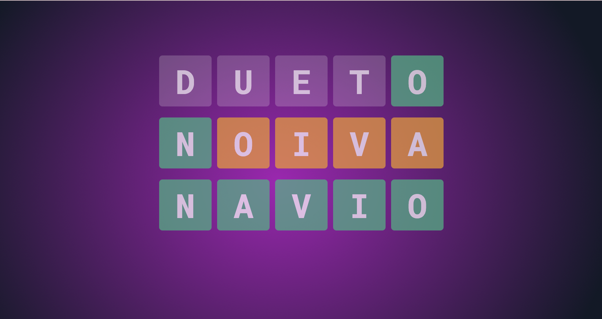

# Wordle Clone in Portuguese
one random word per day, with 5 letters, for you to try to guess in 7 tries. Do you accept the challenge?

### Live: https://jakeliny.github.io/wordle-clone/

 

 
 

# Features:
- [x] Secret Word (CORE)
- [x] Show right letter on right place
- [x] Show right letter on wrong place
- [X] Random word per day
- [X] Random word with 5 letters
- [X] Insert words with 5 letter on database for generator word
- [ ] Insert accent in words after keydown enter
- [ ] Jump between block when filled
- [ ] Count tries, max 7
- [ ] Not mark with yellow when letter already marked with green in the same try